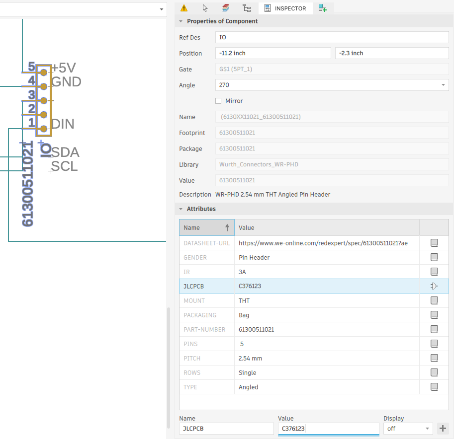
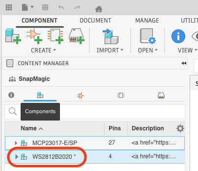
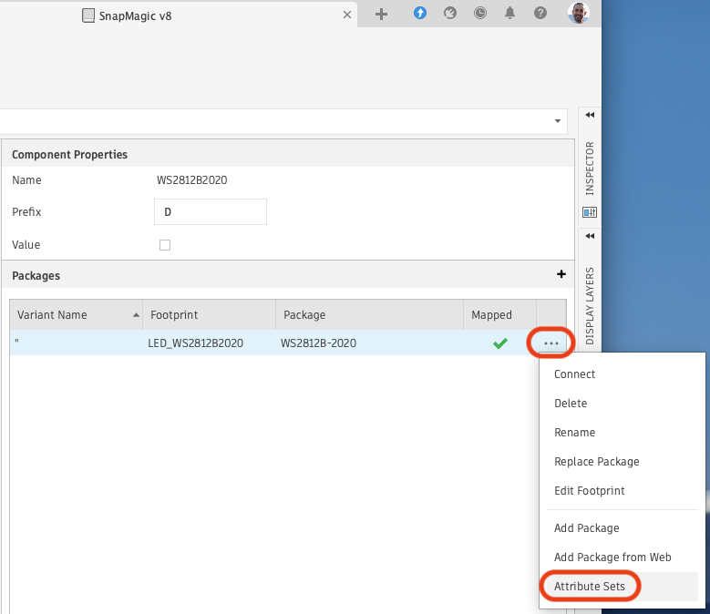
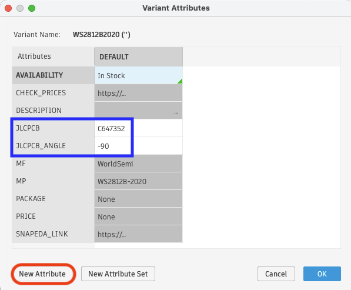
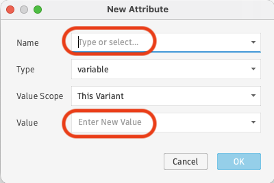
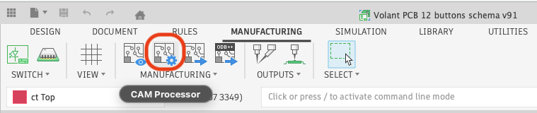
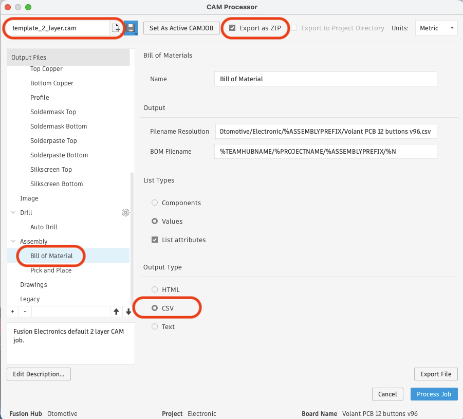
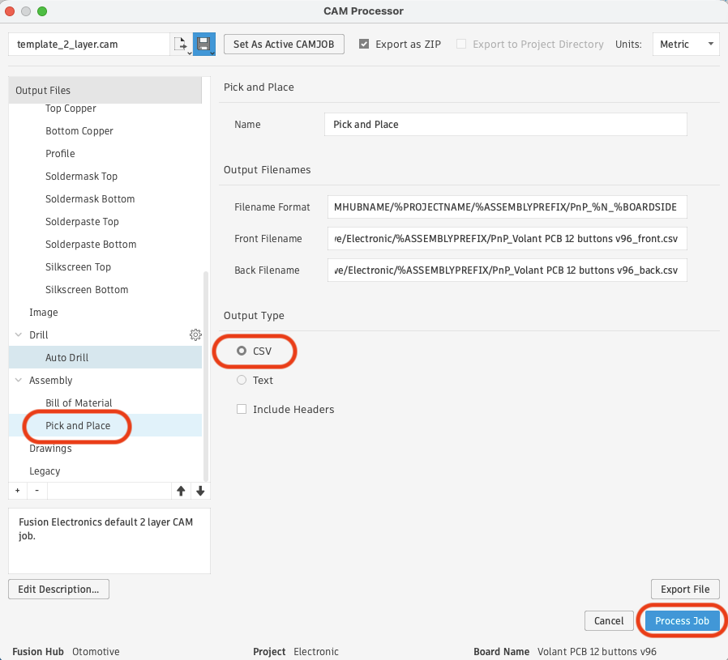

# autodesk-fusion-360-pcb-manufacturer

Tool used to convert from Autodesk Fusion 360 ZIP file with CSV for BOM and PnP.

## Usage

### Adding references to components

- Open your electronic design ;
- Click on a component ;
- Open "INSPECTOR" tab ;
- Open toggle "Attributes" ;
- If your manufacturer is JLCPCB, add an attribute "JLCPCB" with the JLCPCB reference as value (e.g. "C376123") ;
- If the component is not shown with the good orientation in your manufacturer preview, add an attribute "CORRECTION_ANGLE" with the value "-90" to rotate the component by 90° in counter-clockwise direction ;

### Adding references to components in your library

- Open your electronic library ;
- Select a component in "Components" tab ;
- 
- Click on "..." menu under "Packages" then on "Attribute Sets" sub-menu ;
- 
- Click on "New Attribute" ;
- 
- Enter a "Name" and a "Value" for your attribute (e.g. "JLCPCB" with value "C647352"), then click on "OK" twice ;
- 

### Export

Open your electronic 2D drawing in Autodesk Fusion 360, then click on the "Manufacturing" tab and select "CAM processor".

- Select a template matching your number of layers ;
- Select "Export as ZIP" ;
- Select "Assembly > Bill of Material" in "Output Files" ;
- Select "CSV" in "Output Type" ;

- Select "Assembly > Pick and Place" in "Output Files" ;
- Select "CSV" in "Output Type" ;
- Click on "Process Job" to export the ZIP file.
